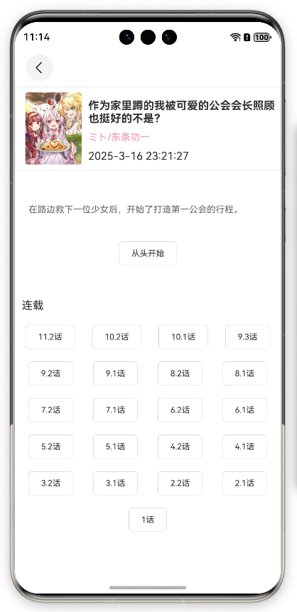
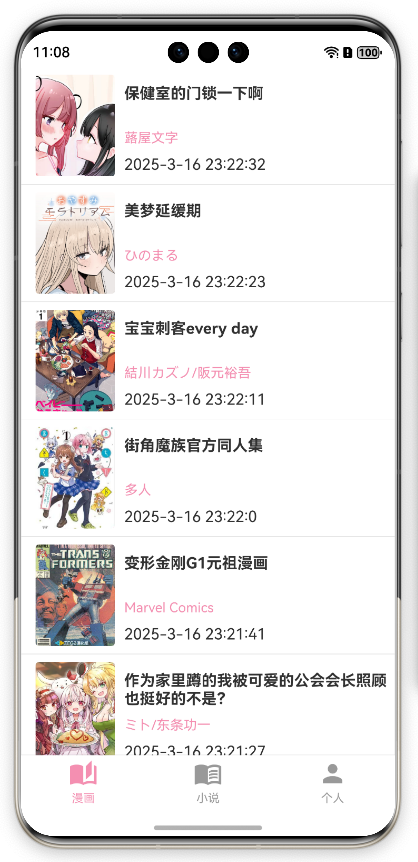

Daisy OHOS
==========

一个简洁大方的漫画与轻小说客户端, 为鸿蒙NEXT系统构建.

如果您觉得此软件对您有帮助，可以star进行支持。同时欢迎您issue，一起让软件变得更好。

仓库地址 https://github.com/niuhuan/daisy-ohos

## 软件截图

## 技术架构

客户端使用前后端分离架构, ArkUI作为渲染框架. rust作为底层调度网络和文件系统.

### 如何构建

1. 安装DevEco-Studio, rust-lang
2. `make`
3. 使用DevEco构建Hap或执行`make all`

### 如何开发调试

阅读鸿蒙官方开发指南

### 责任声明

- 仓库中的源码您可以按照 [LICENSE](LICENSE) 使用。
- 此APP含有"吸烟/饮酒/斗殴/言情/两性"等内容或间接性描述, 因此理论限制级别为"R12+PG14"，即在12岁以上才能使用, 14岁以下的用户在监护人陪同下使用。
- 作者不作任何软件分发，您应当在使用或传播过程中遵守当地法律法规，因传播载造成的法律问题或纠纷，不承担任何责任，需行为人自行承担。
